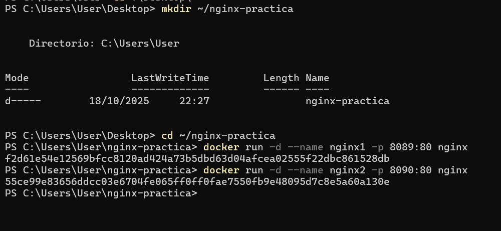
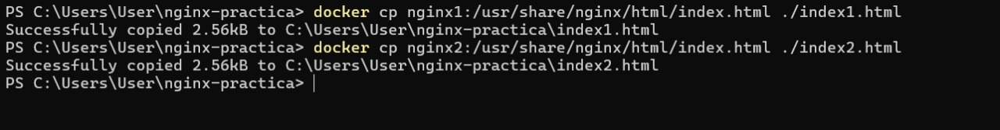
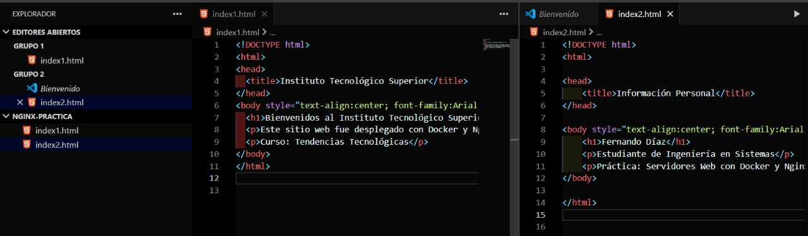
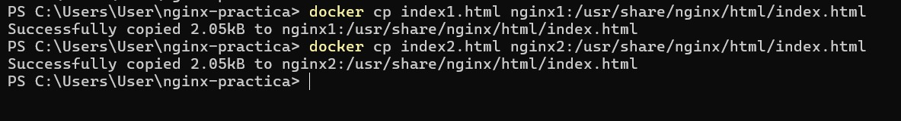
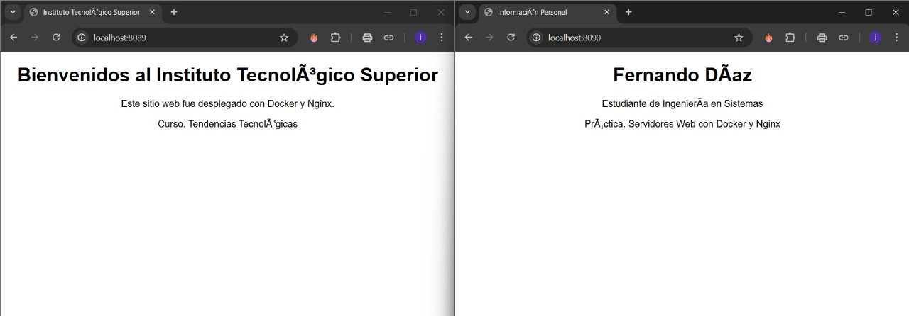
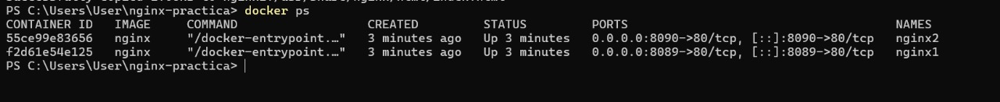

Practica de Creación y Personalización de Servidores Web con Nginx usando Docker
1. Titulo
Implementación de dos servidores web con Nginx en contenedores Docker

2. Tiempo de duración
Tiempo utilizado: 240 minutos

3. Fundamentos:
Docker es una herramienta que permite crear, distribuir y ejecutar aplicaciones dentro de contenedores. Un contenedor incluye todo lo necesario para que una aplicación funcione: el sistema base, las dependencias y la configuración específica, lo que garantiza su portabilidad entre diferentes entornos.

Nginx, por su parte, es un servidor web de alto rendimiento y código abierto, utilizado ampliamente para servir aplicaciones web, actuar como proxy inverso y balanceador de carga. Cuando se combina Nginx con Docker, se obtiene una solución potente para el despliegue rápido de sitios web y servicios.

En esta práctica, se crean **dos contenedores independientes con Nginx**, cada uno sirviendo una página HTML personalizada:
- El primer contenedor (nginx1) muestra mi información institucional.
- El segundo contenedor (nginx2) muestra mi informacion personal.

Este ejercicio permite comprender el uso básico de Docker, la gestión de contenedores, la manipulación de archivos dentro de ellos y la relación entre el contenedor y el sistema anfitrión (host). Además, refuerza el uso de comandos en Linux, la edición de archivos con `nano` y la exposición de servicios mediante puertos específicos.

Figura 1-1.Diagrama Docker

4. Conocimientos previos.

Para realizar esta práctica, debemos tener claro los siguientes temas:
- Comandos básicos de Linux (`cd`, `ls`, `cp`, `nano`, etc.).
- Conceptos de contenedores, imágenes y volúmenes en Docker.
- Uso de terminal (bash o PowerShell).
- Manejo básico de HTML.
- Navegación en el navegador para probar puertos locales.r.

5. Objetivos a alcanzar
- Implementar contenedores con Nginx utilizando Docker.  
- Manipular archivos HTML dentro de contenedores.  
- Comprender la exposición de servicios mediante puertos.  
- Editar y personalizar el contenido de un servidor web desde la línea de comandos. 

6. Equipo necesario:
- Computador con sistema operativo Windows 11 Home.  
- Docker Desktop v4.48.0 instalado.  
- WSL2 con distribución Ubuntu 24.04.  
- Navegador web actualizado (Edge, Chrome o Firefox).  
- Conexión a Internet para descargar imágenes desde Docker Hub.

7. Material de apoyo.
- [Documentación oficial de Docker](https://docs.docker.com/)  
- [Guía de la asignatura Tendencias Tecnológicas](https://github.com/maguaman2/informe-tendencias)  
- [Repositorio oficial de Nginx en Docker Hub](https://hub.docker.com/_/nginx)  
- Hojas de comandos de Linux (Linux Cheat Sheet).  

8. Procedimiento

-Paso 1: Crear contenedores Nginx
docker run -d --name nginx1 -p 8089:80 nginx
docker run -d --name nginx2 -p 8090:80 nginx

-Paso 2: Crear carpeta de trabajo y copiar archivos index.html

-Paso 3: Editar el archivo institucional

-Paso 4: Copiar los archivos modificados dentro de los contenedores

-Paso 5: Verificar los resultados

9. Resultados esperados:
Al finalizar la práctica:

Los dos contenedores Nginx estarán ejecutándose de forma independiente.

El contenedor nginx1 mostrará información institucional en el puerto 8089.

El contenedor nginx2 mostrará información personal en el puerto 8090.

Se verificará que Docker gestiona los servicios web correctamente sin conflictos de puertos.

10. Bibliografía
Docker Inc. (2025). Docker Documentation. Recuperado de https://docs.docker.com/

Nginx Inc. (2025). Nginx Official Image. Recuperado de https://hub.docker.com/_/nginx

Magua, M. (2025). Plantilla de informe de prácticas de Tendencias Tecnológicas. GitHub: https://github.com/maguaman2/informe-tendencias